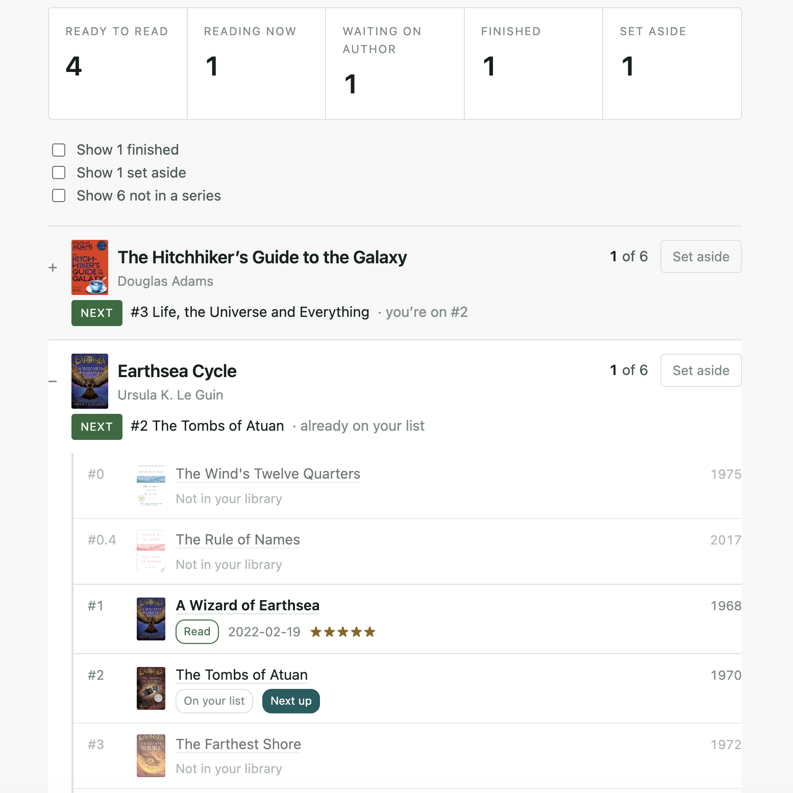

# Loose Ends

Find the book series you never finished. Drop in your Goodreads export —
it's parsed in your browser, never uploaded.



## Why

Every reading tracker thinks in books. Almost none of them think in **series**,
which is how a lot of fiction is actually read. Loose Ends answers one question:
*which series am I part-way through, and what comes next?*

For each series it shows how many you've read, which volume is next, and whether
that volume is out, announced for a future date, or not announced at all — the
last of which is a real answer, not a gap.

## How it works

Your Goodreads CSV is read **entirely in the browser**. Series names come out of
the Goodreads title strings, and volume lists come from
[Hardcover](https://hardcover.app) through a small server function that holds the
API token. Nothing about you is uploaded and nothing is stored: close the tab and
it's gone.

## Why Hardcover

Every candidate was measured against a real library — the 30 series this
reader had read most of — rather than against a few hand-picked titles. A
source counts for a series only if it returns **two or more ordered volumes**;
one book with no siblings cannot answer "what comes next".

| Source | Usable | Why |
|---|---|---|
| **Hardcover** | **30 / 30** | a community tracker built around series |
| Wikidata | 0 / 30 | encyclopedic: strong on canonical fiction, absent for indie and genre series |
| Open Library | 0 / 30 | indexes the titles, does not curate series structure |
| Google Books | 0 / 30 | `seriesInfo` describes Google's own collected editions, not the author's series |
| BookBrainz | 0 / 30 | requests succeed, the data is not there yet |
| LibraryThing | 0 / 30 | deep Common Knowledge data, but not for this catalogue |
| Goodreads API | — | retired in 2020, no new keys, and their terms forbid automated access |

That is a starker result than expected, and it settles the design: there is no
second source to fall back to, and no source chain worth building. If your
reading is mostly prize-list literary fiction, Wikidata would serve you well.
For contemporary genre fiction — romantasy, progression fantasy, anything indie
— the open catalogues have close to nothing, and that gap decided the
architecture.

### Re-checking that choice

Source coverage changes. `scripts/probe-sources.mjs` measures each candidate
against a real library rather than against a few hand-picked titles:

```bash
npm run probe -- ~/Downloads/goodreads_library_export.csv --sample 30
npm run probe -- export.csv --all --markdown          # regenerate the table above
npm run probe -- export.csv --only wikidata,bookbrainz
```

It reads your export, takes the series you've actually read most of, and asks
each source the only question that matters: *which volumes exist, and in what
order?* A source counts as usable for a series only if it returns **two or more
ordered volumes** — one book with no siblings cannot answer "what comes next".

Sources needing a key are skipped rather than failed, and each is paced under
its own published rate limit.

## Using the Hardcover API responsibly

Hardcover is a small team giving away a genuinely good API. This project tries
to cost them as little as possible.

- **Only public series metadata.** Series names, volume lists, positions,
  publication dates, titles and cover URLs. It never reads `me`, `user_books`,
  or any Hardcover user's library — including the token owner's.
- **Cached, so the same series is never asked for twice.** Resolved series are
  stored in Cloudflare D1 for 30 days if every volume is published, and 1 day if
  any volume is unreleased or undated. For a 73-series library that is roughly
  28 upstream requests per day, shared across every visitor, rather than 73 per
  person per visit.
- **Paced under the published limit.** One request per 1.1 seconds against a
  60/minute allowance, with backoff on 429 rather than retry storms.
- **Batched.** Volume lookups use GraphQL aliases to fetch five series per
  request, the documented maximum.
- **Throttled at our end too.** 30 requests per minute per visitor IP, so one
  client cannot spend the whole budget.
- **Credited.** Every book title links to its Hardcover page, and the footer
  credits Hardcover on every screen.

The token is read only server-side, in a Cloudflare Worker. It never reaches the
browser.

## Getting your Goodreads export

**My Books → Tools → Import and export → Export Library.**

Desktop browser only; the mobile app has no export. Don't open the file in Excel
first — it mangles ISBNs and dates.

## Why there's no "log in with Goodreads"

Goodreads retired its API in December 2020 and issues no new keys. Its terms
prohibit "data mining, robots, or similar data gathering and extraction tools",
so logging in on your behalf and reading your shelves is off the table.

The CSV export is your own data, offered officially. It's also richer than the
API ever was — shelves, dates, ratings, review text and custom shelves in one
file.

## Development

```bash
npm install
cp .env.example .env.local   # add a Hardcover API token
npm run dev
```

A Hardcover token comes from **hardcover.app → account settings → Hardcover
API**. It is only ever read server-side — by the Vite middleware in
development, by the Worker in production — and never reaches the browser.

Deployment needs the token set separately, as a Worker secret:

```bash
npx wrangler secret put HARDCOVER_TOKEN
```

`.env.local` is gitignored and never reaches Cloudflare. Note that a *build*
variable in the dashboard is not the same thing as a *runtime* secret: the
build one is visible to `npm run build` and invisible to the Worker.

## Status

Early, but working. It reads an export, resolves series, and tells you what to
read next.

It is deployed, but the URL has deliberately not been shared with anyone.
Hardcover's API terms say the API is for "localhost or APIs"; whether a public,
free, non-commercial site is acceptable is a question for them, and it has been
asked. Until there's an answer, this stays a repository you can run yourself
rather than a service. See `TODO.md`.

## Thanks

Series data and cover images from [Hardcover](https://hardcover.app).

## License

MIT
