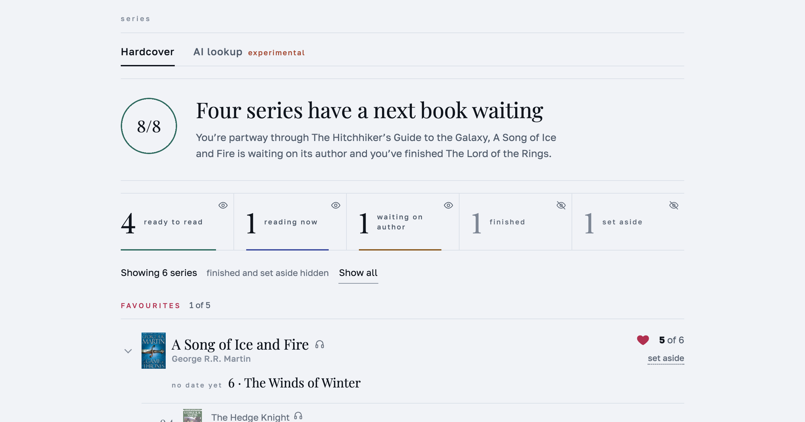

# Loose Ends

Find the book series you never finished. Drop in your Goodreads export —
it's parsed in your browser, never uploaded.

## Why

Every reading tracker thinks in books. Almost none think in **series**, which
is how a lot of fiction is actually read. Loose Ends answers one question:
*which series am I part-way through, and what comes next?*

For each series it shows how many you've read, which volume is next, and
whether that volume is out, announced for a future date, or not announced at
all — the last of which is a real answer, not a gap.

## Using it

**Open it:** <https://looseends.karska-dev.workers.dev/> — or press **Try a
sample library** there to see it without a file.

**Get your export:** on Goodreads, **My Books → Tools → Import and export →
Export Library**.

Desktop browser only; the mobile app has no export. Don't open the file in
Excel first — it mangles ISBNs and dates.

Then drop the file in. There is no account, no sign-up and nothing to install.
Your library is read in the browser and never uploaded; close the tab and it's
gone. The only thing that leaves your machine is a list of series *names* and
their authors, sent to look up which books are in them: to Hardcover, and to
two more services only if you use the experimental
[AI lookup tab](#the-ai-lookup-tab-experimental). Pressing **Look up**, or
opening that tab, also runs Cloudflare Turnstile — a quick check that you're
a person, usually invisible. It sees your browser, not your books; it keeps
the lookup for readers rather than scripts, since every lookup is answered
with this site's own access to those services.

The page comes in English and Ukrainian. It opens in the one your browser
asks for, and **EN / УКР** at the top switches it. Book titles, series and
author names are shown as they are; only the page around them is translated.

Heart up to five series to keep them at the top, and set aside the ones you've
walked away from. Those choices — series names only, not your books — are
remembered in this browser's local storage, never sent anywhere, and
**Forget my choices** at the top of the board clears them.

## Why Hardcover

Five other sources were measured against a real 73-series library — Wikidata,
Open Library, Google Books, BookBrainz and LibraryThing. Against the 30 series
that library had read most of, [Hardcover](https://hardcover.app) answered
**30 of 30** and every other source answered **0**.

The reason is in Hardcover's librarian documentation: series membership and
positions are **entered by hand** by volunteers. That data is not imported
from anywhere, which is why no open catalogue has it. For contemporary genre
fiction especially — romantasy, progression fantasy, anything indie — there is
no second source.

Hardcover were asked before this went public, and the answer was specific to
this deployment: a server-side token is fine provided usage stays inside the
API limits, and visitors do not need Hardcover accounts. Anyone forking this
and putting it online should ask them too. Series lookups are cached and shared
between visitors, so a series someone has already looked up costs nothing the
next time, and no Hardcover user's own library is ever read.

## The AI lookup tab (experimental)

Hardcover is the main source and the tab that opens. Beside it is a second
tab, marked experimental, for the series Hardcover doesn't have or has wrong.
It looks the series up on the open web instead: a web search finds pages
about it, an AI model reads them and lists the books, and then plain code
keeps only what those pages actually say. A title that is on none of the
pages is dropped. A book's number is read off the pages, not taken from the
model. A date is kept only if a page gives it next to that title. Every book
links to the page it came from.

It can still be wrong, which is why it has its own tab and its results are
never mixed with Hardcover's. Measured on 31 series from a real library, it
found 30 and numbered 89% of their main books the way Hardcover does; 21 of
the 30 were right from the first book to the last. When it goes wrong it is
mostly one of three things: the newest book is missing, a novella is counted
as a whole book, or a book is lost where two sources number the series
differently. There is no cover art, and a release date no page gave is shown
as "?" rather than guessed. Check the linked page before you buy.

**What it sends.** The same series names and authors as the Hardcover lookup,
and nothing about you or your books. They go to [Tavily](https://tavily.com),
which runs the web search, and to Cloudflare Workers AI, which reads the pages
the search found. Tavily's terms allow it to keep search queries and use them
to improve its models. Nothing goes to either until you press the button on
that tab, and then only for series the site has no answer for yet. Goodreads
and Amazon pages are never read.

**What it costs.** Nothing, by staying inside free allowances — which means
everyone using the site shares about 30 new AI lookups a day. A series anyone
has looked up before is remembered and shows at once, without using any.

## Why there's no "log in with Goodreads"

Goodreads retired its API in December 2020 and issues no new keys. Its terms
prohibit "data mining, robots, or similar data gathering and extraction
tools", so logging in on your behalf and reading your shelves is off the
table.

The CSV export is your own data, offered officially, and it's richer than the
API ever was — shelves, dates, ratings, review text and custom shelves in one
file.

## Status

Early, but working. English editions only — side stories and extras that
exist only in another language are left out, and a main-series book with no
English edition yet is shown under its most-read title rather than hidden.
Around 10% of books carry no series in their Goodreads title; those are listed
separately rather than matched, and a series whose Goodreads name differs from
Hardcover's can mis-match. The AI lookup tab is an experiment and says so;
what it gets wrong is described above.

## Contributing

See [CONTRIBUTING.md](CONTRIBUTING.md) for setup, architecture and the
gotchas worth knowing before you change anything.

## Thanks

Series data and cover images from [Hardcover](https://hardcover.app) — the
only catalogue that has this data, because their librarians typed it in.
Thank you.

## License

MIT
